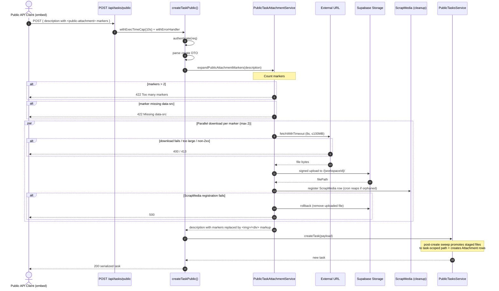

# Public Task Creation — Attachment Flow

How attachments get into a task created through the **public API** (`POST /api/tasks/public`),
used by external/embed integrations (e.g. the Copilot embed).

Unlike the in-app editor, public callers can't run an interactive upload widget. Instead they embed
**`<public-attachment>` markers** in the task `description`. The API downloads each referenced URL,
stages the file in storage, and rewrites the marker into real attachment markup before the task is saved.

---

## At a glance

|                       |                                                                  |
| --------------------- | ---------------------------------------------------------------- |
| **Endpoint**          | `POST /api/tasks/public`                                         |
| **Trigger**           | `<public-attachment>` markers in the `description` field         |
| **Max attachments**   | **2 per task** (`MAX_PUBLIC_ATTACHMENT_MARKERS`)                 |
| **Max size per file** | **100 MB** (`MAX_UPLOAD_LIMIT`)                                  |
| **Download timeout**  | 8 s per file (`DOWNLOAD_TIMEOUT_MS`)                             |
| **Allowed protocols** | `http:` / `https:`                                               |
| **Update endpoint**   | ❌ `PUT /api/tasks/public/[id]` does **not** support attachments |

---

## Marker format

Embed one self-closing marker per attachment inside the description body:

```html
<public-attachment
  data-src="https://example.com/files/report.pdf"
  data-filename="report.pdf"
  data-filetype="application/pdf"
/>
```

| Attribute       | Required | Purpose                                               |
| --------------- | -------- | ----------------------------------------------------- |
| `data-src`      | ✅       | External `http(s)` URL to download. Missing → `422`.  |
| `data-filename` | optional | Overrides the filename inferred from the response.    |
| `data-filetype` | optional | Overrides the MIME type inferred from `Content-Type`. |

After expansion the marker is replaced with:

- **Images** (`mimeType` starts with `image/`): ``
- **Everything else**: `<div data-type="attachment" data-src="..." data-filename="..." data-filetype="..." data-filesize="..." data-loading="false"></div>`

---

## The 2-attachment limit

Enforced in `expandPublicAttachmentMarkers()`:

```ts
// public-attachment.service.ts:17
const MAX_PUBLIC_ATTACHMENT_MARKERS = 2

// public-attachment.service.ts:62
if (matches.length > MAX_PUBLIC_ATTACHMENT_MARKERS) {
  throw new APIError(
    httpStatus.UNPROCESSABLE_ENTITY,
    `Too many <public-attachment> markers in description: received ${matches.length}, maximum is ${MAX_PUBLIC_ATTACHMENT_MARKERS} per task.`,
  )
}
```

A request with **3+ markers** is rejected with **`422 Unprocessable Entity`** — no files are downloaded.
The cap counts markers in the body, so it limits attachments regardless of file size.

To change the limit, edit the single `MAX_PUBLIC_ATTACHMENT_MARKERS` constant.

---

## End-to-end flow



---

## Why staging + ScrapMedia?

Files are first uploaded to a **workspace-root path** (`/{workspaceId}`) — the same location the in-app
editor uses before a task is saved — and tracked with a **ScrapMedia** row. This gives two guarantees:

1. **No leaks**: if the task is never created (or the upload is orphaned), a cron job reaps the staged file.
2. **Atomic-ish rollback**: if ScrapMedia registration fails, the just-uploaded Supabase file is deleted
   immediately so it can't leak.

After the task is created, a **post-create sweep** moves the file to the task-scoped path and creates the
real `Attachment` row. The sweep finds files by grabbing the last `src="..."` in each tag — which is why
`data-src` is the only `src`-suffixed attribute the service emits.

---

## Error responses

| Condition                                    | Status | Source                          |
| -------------------------------------------- | ------ | ------------------------------- |
| More than 2 markers                          | `422`  | `expandPublicAttachmentMarkers` |
| Marker missing `data-src`                    | `422`  | `expandPublicAttachmentMarkers` |
| Invalid / non-http(s) URL                    | `400`  | `uploadFromUrl`                 |
| Download non-2xx / network error / timeout   | `400`  | `fetchWithTimeout`              |
| File exceeds 100 MB (advertised or actual)   | `413`  | `fetchWithTimeout`              |
| Storage upload failure                       | `400`  | `stageFile`                     |
| ScrapMedia tracking failure (after rollback) | `500`  | `stageFile`                     |
| Whole route exceeds 10 s                     | capped | `withExecTimeCap`               |

---

## Update endpoint does **not** support attachments

`PUT /api/tasks/public/[id]` → `updateTaskPublic()` **never calls** `expandPublicAttachmentMarkers()`:

```ts
// public.controller.ts:85
export const updateTaskPublic = async (req: NextRequest, { params }: IdParams) => {
  const { id } = await params
  ValidateUuid(id, PublicResource.Tasks)
  const user = await authenticate(req)
  const data = PublicTaskUpdateDtoSchema.parse(await req.json()) // no attachment expansion

  const tasksService = new PublicTasksService(user)
  const updatePayload = await PublicTaskSerializer.deserializeUpdatePayload(data, user.workspaceId)
  const updatedTask = await tasksService.updateTask(id, updatePayload)

  return NextResponse.json(await PublicTaskSerializer.serialize(updatedTask))
}
```

**Implications for callers:**

- Attachments can only be added **at creation time** via `POST /api/tasks/public`.
- Sending `<public-attachment>` markers in an **update** body does **not** expand them — the raw marker
  text is persisted as-is into the description (it is _not_ downloaded, staged, or rendered).
- To attach files to an existing public task, recreate it, or use the in-app/authenticated flow.

> If attachment support on update is ever needed, mirror the create path: call
> `expandPublicAttachmentMarkers(data.description)` inside `updateTaskPublic` before deserializing.

---

## Source map

| Concern                         | File                           | Symbol / line                                        |
| ------------------------------- | ------------------------------ | ---------------------------------------------------- |
| Route registration              | `route.ts`                     | `POST` (`withExecTimeCap(..., 10_000)`)              |
| Create handler                  | `public.controller.ts`         | `createTaskPublic()` — expands at `:73`              |
| Update handler (no attachments) | `public.controller.ts`         | `updateTaskPublic()` `:85`                           |
| Marker expansion + limit        | `public-attachment.service.ts` | `expandPublicAttachmentMarkers()` `:57`, limit `:17` |
| Download from URL               | `public-attachment.service.ts` | `uploadFromUrl()` `:98`                              |
| Stage to storage + ScrapMedia   | `public-attachment.service.ts` | `stageFile()` `:141`                                 |
| Bounded fetch (timeout + size)  | `public-attachment.service.ts` | `fetchWithTimeout()` `:189`                          |
| Markup builder                  | `public-attachment.service.ts` | `buildMarkup()` `:33`                                |
| Global size limit               | `src/constants/attachments.ts` | `MAX_UPLOAD_LIMIT` (100 MB)                          |
| Create DTO                      | `public.dto.ts`                | `publicTaskCreateDtoSchemaFactory()`                 |
| Update DTO                      | `public.dto.ts`                | `PublicTaskUpdateDtoSchema`                          |
